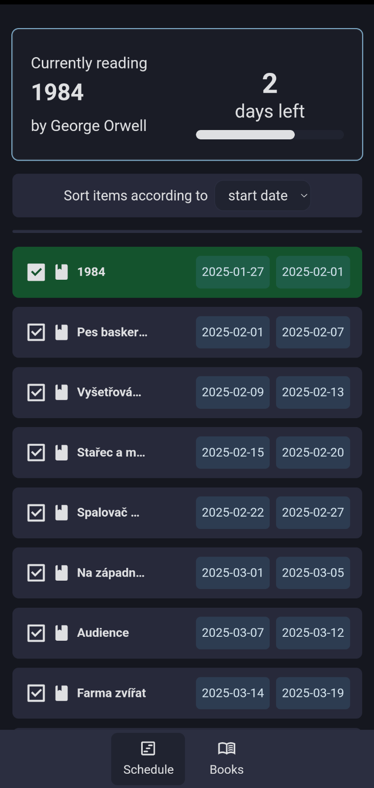
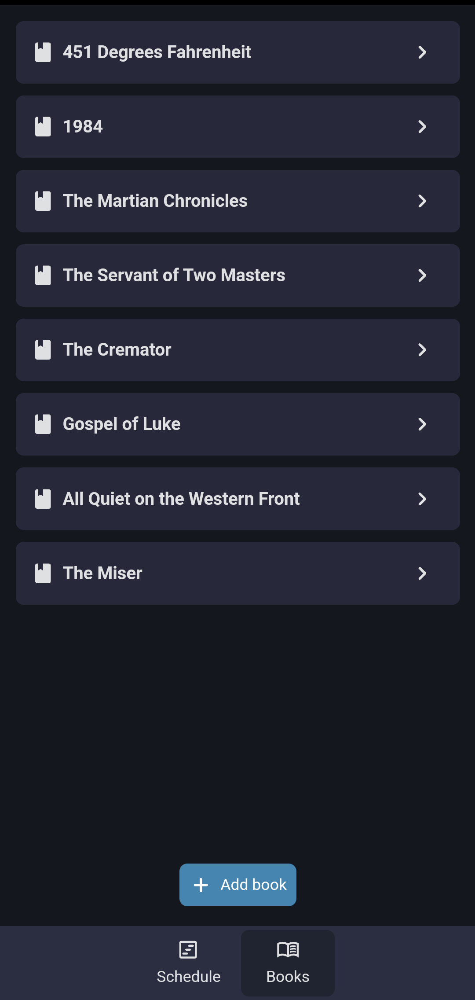
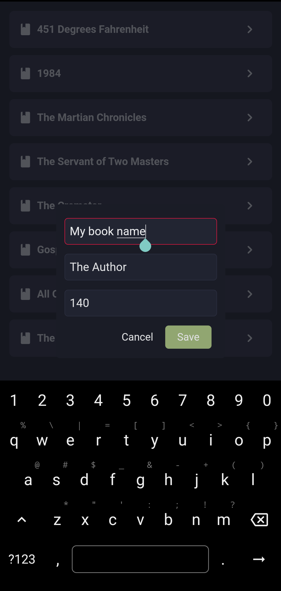

# Book scheduler

<p align="center">
    
</p>
<p align="center">Put your books on a timeline and make a schedule for reading them!</p>

<p align="center">



</p>

## Download

You can head over to the [releases](https://github.com/turtureanu/book-scheduler/releases) and download the latest APK. If you want to build an iOS image see Building.

## Building

The project is made with Capacitor, so you should just be able to:

```sh
git clone https://github.com/turtureanu/book-scheduler.git
cd book-scheduler
npm install # or use bun: bun install
```

For building Android/iOS apps, please have a look at the Capacitor documentation: https://capacitorjs.com/docs/getting-started#create-your-android-and-ios-projects

For developing you can serve the expose the app locally (over IP) with:

```sh
npm run dev --host
```

## Credits

Made with [SvelteKit](https://svelte.dev/docs/kit/introduction), [Capacitor](https://capacitorjs.com/), and [Skeleton](https://www.skeleton.dev/).

Other components used:

- [Svelte Sortable List](https://github.com/rodrigodagostino/svelte-sortable-list) by [@rodrigodagostino](https://github.com/rodrigodagostino)

## License

Project is licensede under the [GPLv3 license](./LICENSE) unless stated otherwise.
